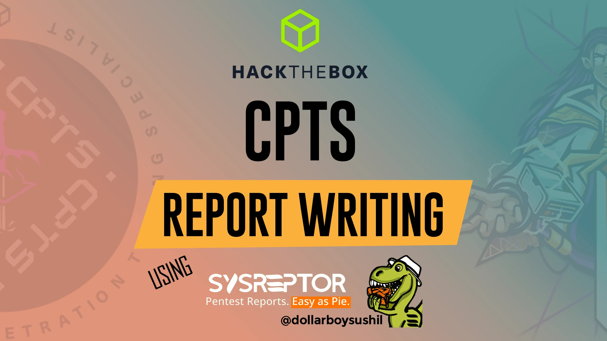

# 🛡️ oscp-cpts-notes

 

***

## 📖 Overview

Welcome to my **OSCP & CPTS Notes** repository!\
I have successfully completed the **Hack The Box CPTS** certification, and these notes capture my entire learning journey — covering everything from fundamentals to advanced penetration testing concepts.

Although I have not yet started the **OSCP** exam, much of the CPTS material overlaps with OSCP preparation. That’s why I’ve organized these notes as **OSCP + CPTS notes** — so they can serve as a valuable study companion for anyone pursuing either certification.

These notes are continuously updated with new topics, improved explanations, and practical methodologies to help readers build a strong penetration testing mindset, not just pass an exam.

💡 **Want the best reading experience?**\
Access the notes via **GitBook** here:\
👉 [**https://notes.dollarboysushil.com**](https://notes.dollarboysushil.com)

***

## 🧾Visit [Here](https://dollarboysushil.com/posts/cpts-report-writing-guide/) to Learn About CPTS Exam Report Writing

<figure><figcaption></figcaption></figure>



***

## 🧠 What's Inside

* 📚 **Theory & Concepts** – Explaining networking, enumeration, privilege escalation, AD attacks, pivoting, and more
* 🛠️ **Hands-on Notes** – Practical steps, methodologies, and tools used
* 🔒 **Real-World Mindset** – Focused on methodology, not just exam prep
* ⚡ **Continuously Updated** – I’m actively adding new content, diagrams, and explanations

> **Note:**\
> Solutions to questions and skill assessments are **not published** due to Hack The Box’s Terms & Conditions.\
> If you're stuck or need guidance, feel free to reach out!

***

## 🚀 How to Use

1. Browse the GitBook for the **structured reading experience**.
2. Search and filter topics to quickly find what you need.
3. Use these notes to **build your own methodology** for OSCP & CPTS.

***

## 🤝 Connect With Me

If you find these notes helpful, let’s connect!

* 🕸️ **Website :** [dollarboysushil.com](https://dollarboysushil.com/)
* 🐦 **Twitter (X):** [@dollarboysushil](https://twitter.com/dollarboysushil)
* ▶️ **YouTube:** [dollarboysushil](https://youtube.com/dollarboysushil)
* 💼 **LinkedIn:** [Sushil Poudel](https://www.linkedin.com/in/dollarboysushil/)
* 💬 **Discord:** [Join my community](https://discord.gg/5jpkdeV)
* 📷 **Instagram:** [@dollarboysushil](https://instagram.com/dollarboysushil)

***

## 🆕 Status: **Actively Maintained**

I am regularly adding:

* ✅ More in-depth explanations
* ✅ Attack flow diagrams
* ✅ Updated methodologies & tools
* ✅ Real-world scenarios

Stay tuned for more content!
