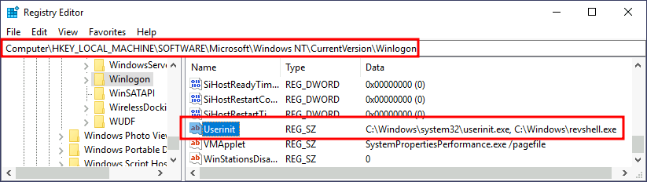

# Logon Triggered Persistence

## Startup folder

Each user has a folder under `C:\Users<your_username>\AppData\Roaming\Microsoft\Windows\Start Menu\Programs\Startup` where you can put executables to be run whenever the user logs in.

If we want to force all users to run a payload while logging in, we can use the folder under `C:\ProgramData\Microsoft\Windows\Start Menu\Programs\StartUp` in the same way.

## Run / RunOnce

You can also force a user to execute a program on logon via the registry. Instead of delivering your payload into a specific directory, you can use the following registry entries to specify applications to run at logon:

* HKCU\Software\Microsoft\Windows\CurrentVersion\Run
* HKCU\Software\Microsoft\Windows\CurrentVersion\RunOnce
* HKLM\Software\Microsoft\Windows\CurrentVersion\Run
* HKLM\Software\Microsoft\Windows\CurrentVersion\RunOnce

The registry entries under HKCU will only apply to the current user, and those under HKLM will apply to everyone. Any program specified under the Run keys will run every time the user logs on. Programs specified under the RunOnce keys will only be executed a single time.

<figure><figcaption></figcaption></figure>

Let's then create a `REG_EXPAND_SZ` registry entry under `HKLM\Software\Microsoft\Windows\CurrentVersion\Run`&#x20;

After doing this, sign out of your current session and log in again, and you should receive a shell&#x20;

## Winlogon

Winlogon uses some registry keys under HKLM\Software\Microsoft\Windows NT\CurrentVersion\Winlogon\ that could be interesting to gain persistence:

Userinit points to userinit.exe, which is in charge of restoring your user profile preferences.
\
shell points to the system's shell, which is usually explorer.exe.

<figure><figcaption></figcaption></figure>

If we can replace anyof the executable with our malicious reverse shell, we will break the logon sequence and get shell.

<figure><figcaption></figcaption></figure>

## Logon scripts

One of the things `userinit.exe` does while loading your user profile is to check for an environment variable called `UserInitMprLogonScript`. We can use this environment variable to assign a logon script to a user that will get run when logging into the machine. The variable isn't set by default, so we can just create it and assign any script we like.

<figure><figcaption></figcaption></figure>
