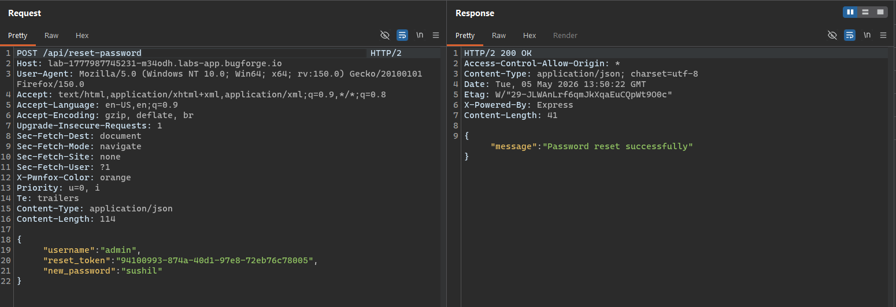

# Tanuki

Level: Easy\
Points: 10\
Type: Daily Challenge

We have option to import decks

<figure><figcaption></figcaption></figure>

The thing that directly picks my eye is ability to import deck in XML format.

To gen an idea about the overall flow, I downloaded the provided sample json file and uploaded it.

<figure><figcaption></figcaption></figure>

```
{
  "name": "Sample Deck",
  "description": "A sample deck showing the import format for custom flashcards",
  "category": "Example",
  "cards": [
    {
      "front": "What is the capital of France?",
      "back": "Paris - the city of lights and capital of France since 987 AD."
    },
    {
      "front": "What programming language is this app built with?",
      "back": "JavaScript - using Node.js for backend and React for frontend."
    },
    {
      "front": "What is a flashcard?",
      "back": "A flashcard is a learning tool that presents information on both sides, typically a question on one side and an answer on the other."
    },
    {
      "front": "What does SRS stand for?",
      "back": "Spaced Repetition System - a learning technique that uses increasing intervals of time between reviews of previously learned material."
    },
    {
      "front": "How do you create a custom deck?",
      "back": "Download this sample file, edit the name, description, category, and cards array with your own content, then upload it using the Import Deck feature."
    }
  ]
}
```

Next, I tried to understand the XML import flow, for this I used deep seek to convert above json to XML

```
<?xml version="1.0" encoding="UTF-8"?>
<deck>
  <name>Sample Deck</name>
  <description>A sample deck showing the import format for custom flashcards</description>
  <category>Example</category>
  <cards>
    <card>
      <front>What is the capital of France?</front>
      <back>Paris - the city of lights and capital of France since 987 AD.</back>
    </card>
    <card>
      <front>What programming language is this app built with?</front>
      <back>JavaScript - using Node.js for backend and React for frontend.</back>
    </card>
    <card>
      <front>What is a flashcard?</front>
      <back>A flashcard is a learning tool that presents information on both sides, typically a question on one side and an answer on the other.</back>
    </card>
    <card>
      <front>What does SRS stand for?</front>
      <back>Spaced Repetition System - a learning technique that uses increasing intervals of time between reviews of previously learned material.</back>
    </card>
    <card>
      <front>How do you create a custom deck?</front>
      <back>Download this sample file, edit the name, description, category, and cards array with your own content, then upload it using the Import Deck feature.</back>
    </card>
  </cards>
</deck>
```

and it is successfully imported:\
Note: edit the file extension and content-type during upload

<figure><figcaption></figcaption></figure>

To make it easier to work with, I compacted the XML length and keeping card count to only one

<figure><figcaption></figcaption></figure>

From here I tried to use various XXE payload from [https://hacktricks.wiki/en/pentesting-web/xxe-xee-xml-external-entity.html](https://hacktricks.wiki/en/pentesting-web/xxe-xee-xml-external-entity.html)

<figure><figcaption></figcaption></figure>

Default payload with \`
